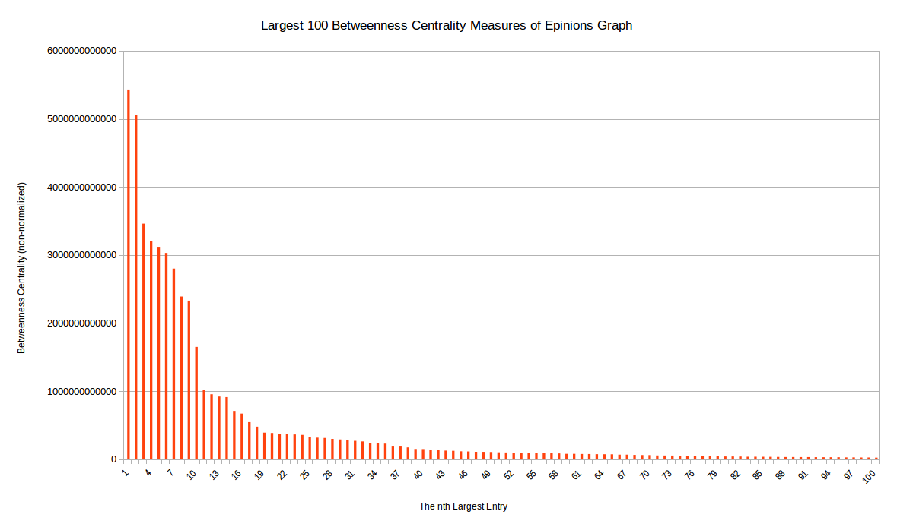

# Epinions Analysis

## Overview: 

This project attempts to identify the most influential people within a social network.

## Data:

The data used models the social network of the Epinions.com community. It was retrieved from [https://snap.stanford.edu/data/soc-sign-epinions.html](https://snap.stanford.edu/data/soc-sign-epinions.html)

Epinions.com is a general consumer review site. It allows users to identify whether they 'trust' or 'distrust' other users' reviews. 

- There are 131828 vertices in this graph that model Epinion.com's users.
- There are 841372 edges in this graph that model either trust or distrust between two users (not necessarily mutual).
- This is a directed, unweighted and signed graph.

## Question:

Consider an advertiser aiming to market a general consumer item. What users would this advertiser approach to market their product as efficiently as possible?
This question can be broken down into two sub questions:
	1) are there closely-knit groups within the network?
	2) who are the most influential people within these groups?

## Analysis of Question:

This question is deceptively simple, and its answer will depend on the context of the social network. Firstly, let's consider some desirable traits of an ideal candidate to be approached by an advertiser:

1) Well respected - the edges leading to this user will be overwhelmingly 'trust' edges
2) Influence over a large number of people - this user has many edges directed at him
3) Influence over other prestigious people - the people this user influences also has many people trusting them
4) The closeness of influence - the user has short paths of influence to many people

It is not clear how these factors should be weighted to optimize the result. For example, would it be best to try to reach a greater amount of users even if the information must travel through many intermediate users (giving these intermediates an opportunity to either not deliver or alter the information) or to fewer users, but have them be closer to the source.

The following attempt at a solution will try to balance these two forces by identifying the nodes with the highest 'betweenness centrality'. This is a measure of how many pairs of individuals would have to go through a node to reach another in their shortest connecting paths.

## High Level Design, Algorithms and Data Structures:

1) Firstly, the strongly-knit communities within the social network must be identified. This will be accomplished by identifying the strongly connected components (SCCs) using Kosaraju's two pass algorithm. This assumes SCCs are a good model for strongly-knit groups.  

	Using this method, one giant SCC was identified.

2) From each of these strongly-knit groups, the betweenness centrality of each node is calculated using Brande's algorithm. Nodes found with high betweenness centrality will be considered influential people and good candidates to be approached by an advertiser. 

	Using this method, about 10 people were found to be good candidates to be approached. (See reflection for details)

The number of edges are approximately linearly proportional to the number of vertices. This would imply a sparse graph. For this reason the main data structure chosen was an adjacency list where each vertex is a user and each arc represents a vertex that has influence over another vertex (i.e. influence will flow in the direction of the arcs). It was decided not to create objects for the vertices and edges as this would add overhead and in this case,  not offer anything useful.  

## Algorithm Analysis:

To Determine the SCCs using Kosaraju's algorithm:

input: Graph as adjacency list
output: an integer array where the index of each entry corresponds to its vertex id, and the value corresponds to which SCC it belongs to (vertices that belong to the same component will have the same value)

Given a directed graph G.

1) Let Grev = G with all arcs reversed
2) run DFS-Loop on Grev
3) run DFS-loop on G

DFS-Loop(Graph G):
	global variable t=0 //tracks finishing times
    global variable s = null // tracks leaders in 2nd pass

    Assumes nodes are labeled from 1 to n
    for i=n to 1
		if i is not yet explored
			s:= i
			DFS(G, i)

DFS(Graph G, node i)
	mark i as explored
	set leader(i) := s
	for each arc (i,j) element of G 
		if j is not yet explored
			DFS(G, j)
	t++
	set f(i) := t // track finishing times in array

### Analysis of Kosaraju's Algorithm:

To create Grev, all vertices must be iterated over, and for each edge, add its head vertex to the new graph with an edge pointing to the old edge's tail vertex.It will take constant time to add the new edge and vertex pair to the new graph and O(n+m) to iterate over all vertices and edges once.

The rest of the algorithm is just two DFS, which runs in O(n+m) each. The total running time is therefore O(n+m).

To Determine the betweenness centrality of each vertex in the SCC using Brande's algorithm:

For each node w element of the SCC
	Initialize:
		mark w as unvisited by setting distance to -1
		 mark predecessor of w to an empty list	
		 set shortestPaths to w as an empty list 
		create empty stack S, to track order of explored vertices
    
     choose a starting node and put it at the beginning of queue, Q.
    set the distance of the starting node , s, to 0. 

	while Q is not empty do:
		dequeue v from Q
		push v onto S
		for each node w, that is pointed to by v do:
			if w is unvisited
				set distance of w to be (distance of v + 1)
				enqueue w
			if distance of w = distance of v + 1  // i.e. is the shortest path to w through v?
				append v to predecessors of w
				set shortestPath to w as (old shortest path to w + shortest path to v)

	create list of dependency's with every vertex initialized to 0 

	while S is not empty do 
		pop w from S
		for each of w's predecssors, v, do
			set dependency of v to (old dependency of v + (shortestPath to v)/(shortestPath to w)*(1 + dependency of w)) 
		if w is not s set betweennessOfCentrality of w to be the old betweennessOfCentrality + dependency of w

### Analysis of Brande's Algorithm

Much of the operations in this algorithm are updating/bookkeeping that can be done in constant time with hash maps/sets. 

The outer loop will iterate over all vertices once. Then :

	The first inner loop is a BFS without the initialization phase, that is, it is only scanning the adjacency lists. This takes omega(E) time. This works for an unweighted graph, but could be changed to use Dijkstra's algorithm to accommodate  a weighted graph (though over all running time would be longer).

	The second inner loop uses the fact that the previous loop has found all the shortest paths from s to other vertices. That is, the actual work inside the for loop is constant! Also, by using a stack, it is ensured that the while loop will start with vertex furthest way from s and proceed in order of decreasing distance between s and w. This means that each edge will only be iterated over once, so the second inner loop will have a complexity of O(E).

This brings the total complexity of the algorithm to be O(V\*E).

## Testing:

The testing approach was to test teach class individually. To be specific it was tested that:

	- the graph was read in properly
	- the SCC were correctly identified
	- the betweenness centrality was correctly calculated

In general, the individual methods within the class were not tested, but rather the high level behaviour of the class.

A testing suite in JUnit was created and each class was tested using a small test cases. The results of these test cases were verified by hand. A few edge cases were considered, most interestingly the case where the flow of betweenness centrality is 'split',  that is, there are multiple shortest paths between two nodes.  

## Reflection and Results:

The results of Kosaraju's algorithm run for the following cases:

(Recall, total vertices = 131292)

Friends arcs only :
	- There were 88609 SCC's found
	- The biggest SCC contained 41441 vertices
	- The next biggest SCC contained 15 vertices

Enemy arcs only : 
	- 131828 SCC's found
	- Every one of the 131828 was of size 1

Unsigned arcs :
	-same results are friends arcs only

First off, the enemy arcs don't seem to formulate any sort of network. This is to be expected, since in this context, an enemy arc means a user simply 'distrusts' another user's review. It is not expected that a user would reciprocate the enemy arc or for any enemy arc groups to form. Comparing the SCC's from the friend graph to the SCC's from the unsigned graph, it seems that most of the arcs are friend arcs. Considering how influence propagates through friend arcs and not enemy arcs in the network, from this point forward only the friends' arcs will be considered.

The second major observation is that there is one giant SCC and the others are negligible in comparison. Having a giant SCC is a common feature in social networks, so this isn't too surprising to see. These results are not too comforting viewed through the eyes of the advertiser. Ideally, many close knit groups would have been identified and the key influential people in each would be approached. One could consider the plausible situation where there would exist closely knit groups within the Epinions community separated by language. That is people would trust or be more influenced by reviews written in their native language while ignoring those in languages they do not understand. It would only take two edges to collapse two of these closely knit groups, making them very fragile. This is likely why these closely knit groups were not found. An interesting extension would be to identify the bridges (edges such that deleting them would split one component into two) in the network in an attempt to break up this large SCC into more distinguished subgroups. Considering the vast difference between the sizes of the largest and second largest SCC, only the largest will be considered from this point on.

Here are the 10 vertices with the highest betweenness centrality found in the largest SCC:

ID  Betweenness Centrality (unnormalized)

59	5.432605660186E12
1	5.053081321758E12
57	3.464923128459E12
324	3.205426860817E12
119	3.115685891292E12
175	3.031304239321E12
44	2.800830296125E12
22	2.38700230062E12
10	2.33086131942E12
78	1.647023917424E12

And here is a graph showing the general distribution of the betweenness centrality :

It can be seen from this, that the majority of betweenness centrality is contained by about 10 vertices. In conclusion an advertiser would like to approach the top 10 people associated with the nodes given above.

